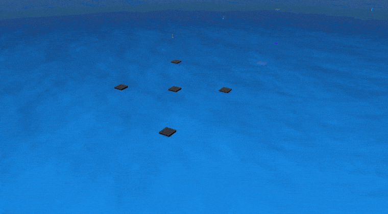
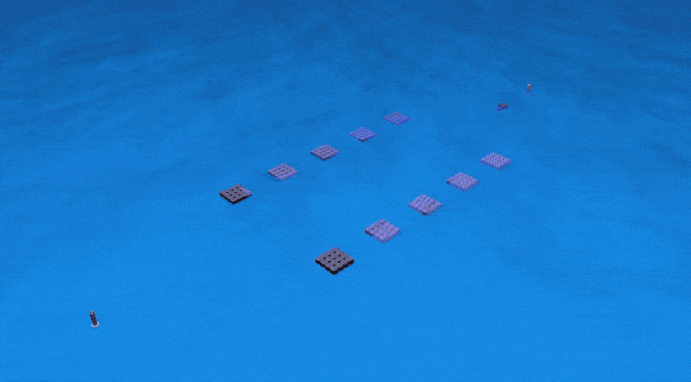
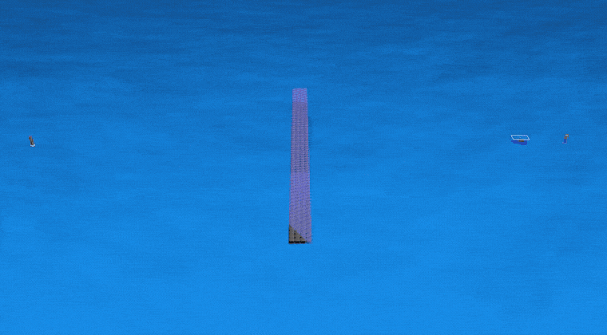
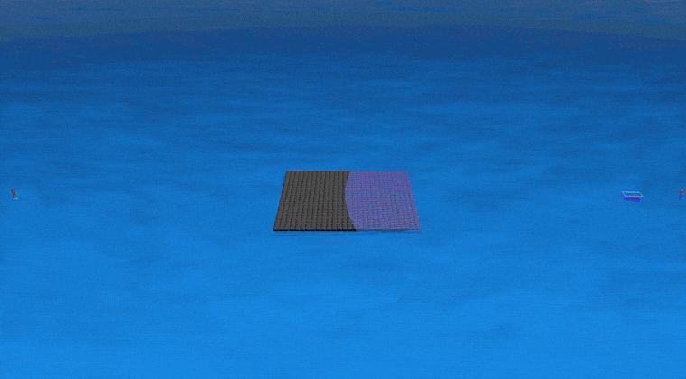
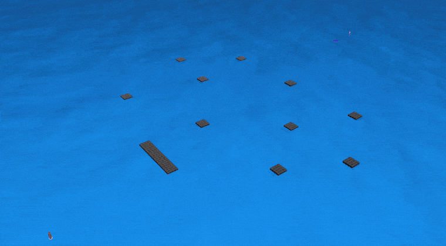

<div align="center">

# 🛥️ USV Safe RL Workspace
### Shielded Reinforcement Learning for Unmanned Surface Vehicles

**A hybrid PPO + MPC safety-filter architecture for autonomous marine navigation, trained in a custom Gymnasium environment and validated in Gazebo 3D (ROS 1).**

[](http://wiki.ros.org/noetic)
[](https://github.com/osrf/vrx)
[](https://www.python.org/)
[-EE4C2C?logo=pytorch&logoColor=white)](https://stable-baselines3.readthedocs.io/)
[](LICENSE)

[](#results)
[](#3d-validation-campaign)

*Research internship — State Key Laboratory of Ocean Sensing, Zhejiang University · Polytech Nice Sophia (Université Côte d'Azur)*

</div>

---

## Overview

Deep Reinforcement Learning produces **agile but unverifiable** navigation policies. Model Predictive Control produces **safe but conservative** (and expensive) ones. This project synthesises both:

> The **RL agent (PPO)** acts as the *brain* — high-level, adaptive navigation.
> The **MPC Predictive Safety Filter** acts as the *spinal cord* — a real-time reflex enforcing hard kinematic constraints on every command before it reaches the thrusters.

The pipeline goes from a pure mathematical prototype (10 000+ simulated steps/second) to a 3D deployment inside Gazebo with a custom multi-layer LiDAR, wind disturbances and wave physics.

<div align="center">
<picture>
  <source media="(prefers-color-scheme: dark)" srcset="media/architecture-dark.svg">
  
</picture>
</div>

---

## Demonstrations

Five validation runs in Gazebo 3D. Each clip is the full run, time-lapsed; the matching
trajectory and thruster plots live in [`tests_file/`](tests_file).

<div align="center">

| Test 1 — Sanity check (chicane) | Test 2 — Narrow corridor |
|:---:|:---:|
|  |  |
| Smooth Sim-to-Sim transfer; the shield rarely intervenes | A ±30° heading clamp keeps the trajectory linear in an 8 m channel |

| Test 3 — Close quarters (orthogonal avoidance) | Test 4 — The Storm (lateral wind) |
|:---:|:---:|
|  |  |
| 3-layer LiDAR fusion resolves overlapping obstacles during a 90° turn | The agent adopts a "crab" sideslip; the shield governs the lateral drift |

| Test 5 — The Full Gauntlet (stress test) |
|:---:|
|  |
| Longest course, tightest geometry, heaviest logging load — **zero collisions** |

</div>

---

## Method

### Vehicle dynamics — Fossen 3-DOF

The MPC predicts the vessel with the standard manoeuvring model, pose $\eta = [x, y, \psi]^T$ and body velocities $\nu = [u, v, r]^T$:

$$\dot{\eta} = R(\psi)\,\nu, \qquad M\dot{\nu} + C(\nu)\nu + D(\nu)\nu = \tau$$

where $M$ includes added mass, $C(\nu)$ the Coriolis terms, $D(\nu)$ the non-linear hydrodynamic damping, and $\tau = [\tau_u, 0, \tau_r]^T$ the differential thrust of the two motors.

### The MPC safety shield

At each tick the RL action $u_{RL}$ is projected onto the safe set by a quadratic program (`scipy.optimize.SLSQP`) over a 2-step horizon ($dt = 0.5$ s ⇒ 1 s look-ahead):

$$\min_{u_{MPC},\,\epsilon} \tfrac{1}{2}\|u_{MPC} - u_{RL}\|_R^2 + W_\epsilon \epsilon^2$$

subject to the Fossen dynamics, actuator saturation, and the collision constraint $\|P_{USV}(t+H) - P_{obs}(t+H)\| \ge d_{safe} - \epsilon$.

The heavily penalised slack $\epsilon$ guarantees feasibility under severe disturbance: instead of an infeasible solve, the filter degrades gracefully into maximum-effort emergency braking.

### Curriculum learning (10 scenarios)

Training PPO directly on dynamic traffic collapses the policy, so the agent is grown through a weighted curriculum:

| # | Scenario | Skill taught |
|:-:|---|---|
| 1 | `free` | Locomotion, heading correction, stopping precision |
| 2 | `static_single` | Elementary avoidance without over-deviating |
| 3 | `static_multi` | Chicane anticipation, multi-obstacle planning |
| 4 | `narrow_corridor` | Precision navigation in an 8 m channel |
| 5 | `moving_follow` | Safe overtaking with lateral offset |
| 6 | `moving_cross` | COLREG-like crossing: cross or yield |
| 7 | `moving_target` | Pursuit of a mobile waypoint |
| 8 | `fast_unpredictable` | Robustness / spatial margin against erratic traffic |
| 9 | `variable_distance_world` | Geometric generalisation (30 m → 100 m) |
| 10 | `mixed_dynamic` | Final synthesis exam |

Key stabilisers: scenario sub-weighting against catastrophic forgetting, learning rate $3\times10^{-5}$, PPO clip range $0.1$, spatial jitter / domain randomisation, and a **shield-intervention penalty** $-0.1\,\|u_{MPC}-u_{RL}\|_2$ that forces the network to internalise the physical constraints instead of leaning on the filter.

---

## Results

### Final benchmark — 100 episodes per scenario

<div align="center">
<picture>
  <source media="(prefers-color-scheme: dark)" srcset="media/benchmark-dark.png">
  
</picture>
</div>

<details>
<summary>Numbers behind the figure</summary>

| Scenario | Success | Collision | Timeout | Mean length |
|---|:---:|:---:|:---:|:---:|
| `free` | **1.00** | 0.00 | 0.00 | 189.5 |
| `narrow_corridor` | **1.00** | 0.00 | 0.00 | 173.3 |
| `moving_follow` | **1.00** | 0.00 | 0.00 | 161.4 |
| `variable_distance_world` | **1.00** | 0.00 | 0.00 | 174.2 |
| `static_multi` | 0.98 | 0.02 | 0.00 | 140.0 |
| `moving_cross` | 0.96 | 0.04 | 0.00 | 168.1 |
| `moving_target` | 0.96 | 0.00 | 0.04 | 373.5 |
| `static_single` | 0.94 | 0.01 | 0.05 | 203.4 |
| `mixed_dynamic` | 0.91 | 0.09 | 0.00 | 142.1 |
| `fast_unpredictable` | 0.88 | 0.12 | 0.00 | 169.4 |

</details>

Two readings matter more than the headline rate. The residual failures concentrate in
`fast_unpredictable` and `mixed_dynamic`, which contain physically unavoidable intercepts —
no controller, learned or otherwise, clears those. And where the agent does fail elsewhere it
prefers to **time out rather than collide** (`static_single`: 5 % timeout, 1 % collision),
which is the conservative bias the shield penalty was designed to instil.

**Network health (TensorBoard):** `approx_kl ≈ 0.006` · `explained_variance = 0.925` · `value_loss = 0.032` · `clip_fraction = 0.05` · `std = 1.13` — a well-behaved trust region, an accurate critic, and preserved exploration.

### 3D validation campaign

Five scripted courses in Gazebo, logged through `rosbag` and replayed with
[`tests_file/plot_rosbag.py`](tests_file/plot_rosbag.py). The shaded halo is the keep-out set
the MPC enforces (1 m obstacle footprint + 2 m clearance).

<div align="center">
<picture>
  <source media="(prefers-color-scheme: dark)" srcset="media/tracks-dark.png">
  
</picture>
</div>

---

## Two engineering findings worth highlighting

### Over-engineering is the enemy

The first Gazebo deployment chattered and pirouetted. Adding defensive layers — state caches,
asynchronous callbacks, nested clamps — made it undebuggable. The fix was *removal*: a single
synchronous 10 Hz loop where observation, inference, shield and actuation share one atomic clock.

### The Observer Effect

Running `rosbag record` collapses the Gazebo real-time factor, which desynchronises the closed
loop. The signature is visible in the thruster commands: on the recorded run the shield issues
**four sustained full-scale reversals (3.4 s at −1.0)**, where the unrecorded baseline over the
same course and window shows a single 0.7 s spike.

<div align="center">
<picture>
  <source media="(prefers-color-scheme: dark)" srcset="media/observer-effect-dark.png">
  
</picture>
</div>

The degradation became a free stress test: **even with a severely lagging RL loop, the shield
kept the collision count at zero.** Note that this is a statement about command effort, not
about the whole campaign — on the longest course (Test 5) the recorded and unrecorded command
profiles are comparably busy, so the effect is clearest on the short, geometrically simple runs.

---

## Getting started

### 1. Requirements

* Ubuntu 20.04 + **ROS Noetic** (`ros-noetic-desktop-full`) and Gazebo 11
* Python 3.8+

Training and evaluation need neither ROS nor Gazebo — only the 3D validation does.

```bash
git clone https://github.com/gt124578/autonomous-rl-mpc-usv.git
cd autonomous-rl-mpc-usv
pip3 install -r requirements.txt
```

### 2. Build the ROS workspace

The repository *is* the catkin workspace — build it from the root:

```bash
catkin_make                 # or: catkin build
source devel/setup.bash
```

So Gazebo can resolve the `model://` references in the world file, point it at the packages:

```bash
export GAZEBO_MODEL_PATH=$GAZEBO_MODEL_PATH:$(pwd)/src:$(pwd)/src/vrx_gazebo/models:$(pwd)/src/wave_gazebo/world_models
```

### 3. Run the 3D simulation

`tests_validation.launch` is the single entry point — it holds the whole validation campaign.

```bash
# terminal 1 — Gazebo, the validation world, and the USV
roslaunch myboat_gazebo tests_validation.launch
```

The launch file loads `worlds/tests_validation.world` (all five courses), spawns the hull at
`(-484.83, 187.72, 2.0)` with the Fossen hydrodynamic coefficients, thrust limits
(`maxForceFwd = 164 N`, `maxForceRev = -100 N`) and PID gains passed as arguments — override
any of them on the command line — and brings up `twist2thrust` in keyboard mode for manual
driving.

Wait for the world to finish loading and the hull to settle, then start the shielded
controller in a second terminal. It loads `usv_rl_brain_final.zip` + `vecnormalize_final.pkl`
and drives `/myboat/thrusters/{left,right}_thrust_cmd` at 10 Hz:

```bash
# terminal 2 — the shielded controller
source devel/setup.bash
python3 programs/usv_controller_final.py
```

To record a run for the trajectory plots of step 5:

```bash
rosbag record -O test_1.bag /gazebo/model_states \
  /myboat/thrusters/left_thrust_cmd /myboat/thrusters/right_thrust_cmd
```

### 4. Train / evaluate the policy (no Gazebo required)

```bash
cd programs
python3 train_rl.py                 # PPO curriculum training
python3 resume_train.py             # fine-tune an existing checkpoint
python3 casino_method.py            # random-restart search on the 10-scenario mix
python3 evaluate_each_scenario.py   # per-scenario success / collision / timeout rates
python3 plot_metrics.py             # learning curves from eval_metrics_history.csv
```

### 5. Reproduce the validation figures

```bash
cd tests_file
python3 plot_rosbag.py              # set BAG_FILE / TARGET / OBSTACLES at the top first
```

---

## Repository layout

```text
autonomous-rl-mpc-usv/
├── programs/                               the maintained implementation — read this one
│   ├── usv_gym_env.py                      custom Gymnasium env: 10 scenarios, 18-D obs, reward shaping
│   ├── mpc_shield.py                       the predictive safety filter (SLSQP quadratic program)
│   ├── USV_dynamics_model.py               Fossen 3-DOF model used by the shield
│   ├── train_rl.py                         PPO curriculum training
│   ├── resume_train.py                     checkpoint fine-tuning with hyperparameter overrides
│   ├── casino_method.py                    random-restart search over the scenario mix
│   ├── auto_training_scenarios.py          curriculum weighting
│   ├── evaluate_each_scenario.py           benchmark harness — success / collision / timeout
│   ├── eval_rl_scenario.py                 single-scenario evaluation
│   ├── plot_metrics.py                     learning curves from eval_metrics_history.csv
│   └── usv_controller_final.py             ROS node: 10 Hz observe → infer → filter → actuate
├── src/                                    ROS packages
│   ├── myboat_gazebo/
│   │   ├── launch/tests_validation.launch  the validation entry point
│   │   ├── worlds/tests_validation.world   the five validation courses
│   │   └── src/                            thrust + dynamics Gazebo plugins, teleop
│   ├── myboat_description/                 URDF / xacro, meshes, 3-layer 360° LiDAR
│   ├── usv_gazebo_plugins/                 buoyancy, wind and acoustic plugins (VRX)
│   ├── wave_gazebo/                        ocean surface and wave physics
│   ├── wave_gazebo_plugins/
│   ├── vrx_gazebo/                         upstream VRX assets
│   └── usv_msgs/
├── tests_file/                             validation-run analysis
│   ├── plot_rosbag.py                      trajectory + thruster plots from a .bag
│   └── test_*_map.pdf / test_*_cmds.pdf    the campaign figures
├── media/                                  README figures and demo GIFs
├── usv_rl_brain_final.zip                  trained PPO policy
└── vecnormalize_final.pkl                  matching observation normalisation statistics
```

`src/vrx_gazebo/models/` ships only the fifteen models `tests_validation.world` actually
loads (≈47 MB of the upstream 231 MB). If you need the full asset set — the other VRX worlds,
`sydney_regatta`, `sandisland` — clone [VRX](https://github.com/osrf/vrx) alongside and add its
`models/` to `GAZEBO_MODEL_PATH`.

---

## What is not in this repository

Two things are deliberately left out to keep the clone light:

* **The internship report** (theory, training methodology, Sim-to-Sim transfer, the full
  validation campaign and the LiDAR URDF appendix) — available on request.
* **The full-resolution screen captures** of the five runs, ≈380 MB. The GIFs in
  [`media/`](media) are the published versions, and [`tests_file/`](tests_file) holds the
  trajectory and thruster plots extracted from the same runs.

---

## Future work

The architecture is **hardware-ready**. The next milestone is deploying the containerised
controller onto the physical USV for real lake trials, where the MPC shield and the domain
randomisation used during training are expected to absorb the remaining Sim-to-Real gap without
risky on-site retraining.

---

## References

1. Wabersich, K. P., & Zeilinger, M. N. (2021). *A Predictive Safety Filter for Learning-Based Control of Constrained Nonlinear Dynamical Systems*. Automatica, 129, 109597.
2. Romero, A., Song, Y., & Scaramuzza, D. *Actor-Critic Model Predictive Control: Differentiable Optimization Meets Reinforcement Learning for Agile Flight*. IEEE T-RO.
3. Song, Y., & Scaramuzza, D. (2022). *Learning High-Level Policies for Model Predictive Control*. IEEE RA-L.
4. Brunke, L., et al. (2022). *Safe Learning in Robotics: From Learning-Based Control to Safe Reinforcement Learning*. Annual Review of Control, Robotics, and Autonomous Systems, 5, 411–444.
5. Fossen, T. I. (2011). *Handbook of Marine Craft Hydrodynamics and Motion Control*. John Wiley & Sons.

---

## Licence

The original work in this repository is released under the [MIT licence](LICENSE). The
simulation assets and Gazebo plugins vendored under `src/vrx_gazebo/`, `src/wave_gazebo/`,
`src/wave_gazebo_plugins/`, `src/usv_gazebo_plugins/` and `src/usv_msgs/` derive from the
[VRX](https://github.com/osrf/vrx) project and remain under Apache 2.0.

---

## Acknowledgments

Work carried out at the **State Key Laboratory of Ocean Sensing, Zhejiang University**, under the supervision of Prof. **Weichang Li** and Dr. **Huarong Zheng**, with the academic support of Prof. **Noëlle Stolfi** (Polytech Nice Sophia). The baseline simulation assets are derived from the open-source [VRX](https://github.com/osrf/vrx) project.

